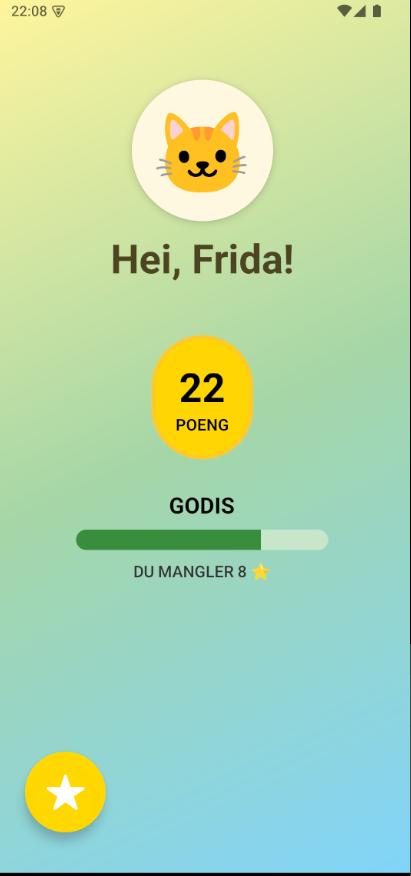
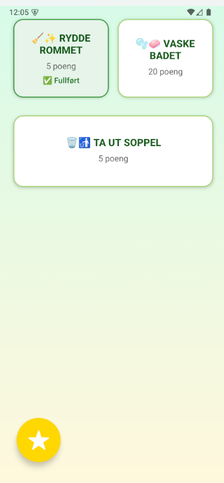
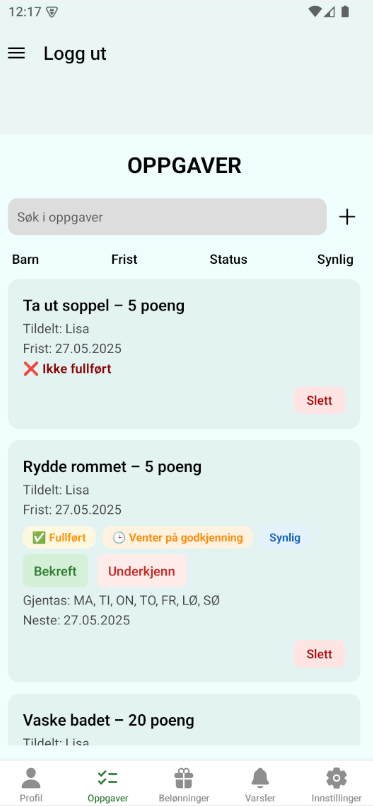
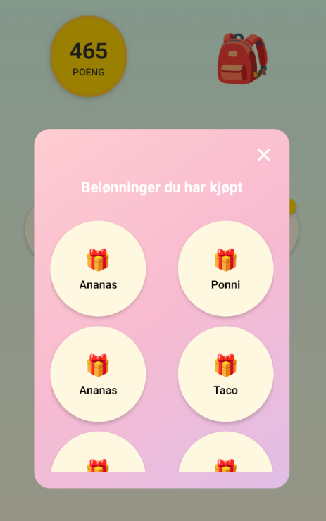
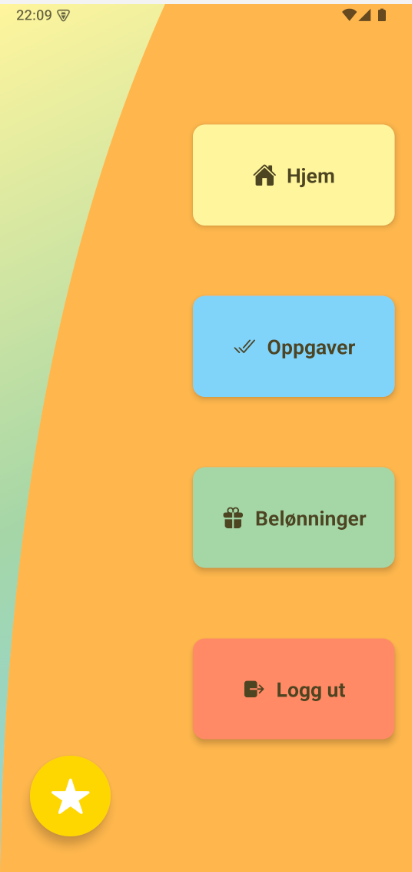

# FortGjort – Household Chore App

FortGjort is a mobile application developed as a group project for the **IKT205 Application Development** course at the University of Agder (UiA), Grimstad.

The app is designed to help families organize household chores while motivating children to participate through a points and reward system. It provides separate interfaces for parents and children, with the child interface designed to be simple, colourful and easy to use.

## Features

* Create and manage households and child profiles
* Create one-time and recurring household tasks
* Assign tasks to children with deadlines and point values
* Allow children to mark tasks as completed
* Parent approval of completed tasks
* Points awarded for completed and approved tasks
* Custom reward system where children can spend earned points
* Separate parent and child interfaces
* PIN-protected access to parental functionality
* User authentication and cloud-based data storage

## Technologies

* React Native
* TypeScript
* Expo
* Expo Router
* Firebase Authentication
* Cloud Firestore
* Expo Crypto
* Maestro
* Figma
* Git / GitHub

## Project Structure

The application source code can be found in the [`chores-application`](./chores-application) directory.

The complete project report is available here: [`Report.pdf`](./Report.pdf).

## Screenshots

  
  
  

  <i>Child home screen, child task overview and parent task management.</i>

  
  

  <i>Reward system and child navigation.</i>

## Reflections

This project gave us practical experience developing a mobile application from the initial idea and requirements through design, implementation, testing and delivery.

A significant part of the project involved learning and working with technologies that were new to the team, particularly React Native, Firebase and several supporting libraries. This required us to continuously adapt and solve technical challenges throughout development.

One of the key lessons from the project was the importance of balancing planning with flexibility. While the project mainly followed a modified waterfall approach, we used Scrum during development to work iteratively, manage the backlog and adjust the solution as the project evolved.

Testing also presented challenges. Our initial goal was to rely more heavily on automated end-to-end testing, but technical limitations led us to use primarily manual testing with Maestro. This provided valuable experience in adapting testing strategies when the original approach does not work as expected.

Overall, the project provided valuable experience in mobile application development, UI/UX design for different user groups, cloud-based data management, security, version control and collaborative software development.

## Who was involved

Nancy Rønqist Erichsen

Adam Hazel

Gunn Marita Jomås-Britten

Nora Lior
##
Developed at the **University of Agder, Campus Grimstad – Spring 2025**.
